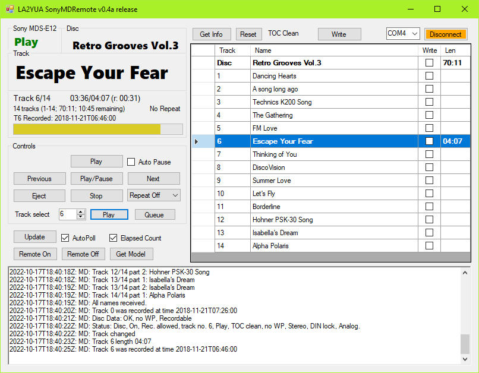

# LA2YUA SonyMDRemote
This is an attempt at making a C# application to talk to a Sony MDS-E12 MiniDisc recorder. If it works it should also work for the E11 and E52 models. 

The goal is to replace the older SonyMDRemote program, which doesn't really work at all on anything modern and is quite buggy even on older systems.

See the Docs folder for the protocol specifications if you want to help.
Currently targets .NET 4.7.2

See also my previous blog post on my E12: [Adding Optical I/O to the Sony MDS-E12 MiniDisc Recorder](http://longview.be/adding-optical-io-to-the-sony-mds-e12-minidisc-recorder.html).

## Hookup
You will need a female-female 9 pin D-Sub adapter cable (a null modem cable):
* Pin 2 to Pin 3
* Pin 3 to Pin 2
* Pin 5 to Pin 5

## Use
To connect, select a COM port from the selector, then click Get Info to start everything for playback/edit mode.

Only checked rows will be written, when reading track data unnamed tracks are automatically marked for writing. You can tab around the view to quickly enter track titles. 

Push the Write button to perform a write, it is best to pause or stop playback before doing this to avoid any issues. After a write you can click Get Info again to reload the data from the MD. The TOC will be dirty after a write, when satisfied hit the Eject button to make the MD commit the TOC and actually update the disc.

You can double click the leftmost part of a row to tell the MD to play a specific track. The currently playing track is highlighted.

The textbox below logs the received data and debug info.

Release builds limits the log scrollback to around 200-400 lines to avoid ballooning memory usage. Debug builds have effectively unlimited scrollback, and generate log output files. Debug builds also add a "Clear" button to the log.

## Features implemented:
* Most MD-PC responses are decoded
* Reading disc name, track numbers etc. is supported
* Keeps track of track lengths
* Basic playback commands
* Write of both disc and track titles - far better than the original Sony program
* TOC dirty indication
* Mouse nav-keys for forward/back (only in the main form area)

## Planned:
* Check of maximum track name length - seems to have a lot of room but would have to really dig into the MD format to figure it out properly
* Recording timestamps seem to exist, not sure if anyone uses those (I didn't know these recorders had clocks...)

Currently timestamps are polled, but not shown in the UI except in the log, and then only if they have valid timestamps. None of my self-recorded discs appear to have valid timestamps.

## Not really working:
* Disc status and Power status appears to be incorrect for the E12
* (v0.2a) Changing discs may lead to slight inconsistencies, e.g. track times are not cleared when reloading track data, so these will be incorrect.
* Write-protection detection seems broken? Can't find a way to detect that using the documented commands.
* Repeat-modes don't work on my unit

## Vague Ideas
Making an ESP-based device that could sit inside the MD recorder, put in a web-interface to replace this project. 

The cleanest mod would be to re-route the cable that goes to the RS-232/Parallel card into a new PCA with the ESP on it. One of the relay connector holes could be repurposed for the Wi-Fi antenna, the RS-232 and parallel D-Subs could be plugged or taped over.

Doing that would also get you free access to the parallel switch I/O's.

5 V power is already available on that plug, though finding the exact mating connector could be challenging since Sony's docs don't list a manufacturer or real part number.

## Will likely not be supported:
* Recording
* Track splitting/editing

I usually just use the autoqueue feature for record so track splits are good right away, and adding track splitting seems complicated.

## Documentation & Player Bugs
Here's what I got so far for erratas.
I've mostly been using the Combined E11, 12, 52 document. The user-made addendun document has also been referenced.

### General Comms
The recorder doesn't clear its output buffers, so many outputs involving text contain trailing garbage after the null termination. This is slightly irritating in C# but manageable.

The protocol has no escape sequences, and the start and stop bytes are also valid payload data, _I don't like this.._

As such, you do need stateful decoder that reads the packet length to determine when to stop and process data. The good news is that communications appear to be pretty reliable.

### Minor Stuff
There's no way to read back the "Auto Pause" flag once you set it, you just have to know. This program does not store that, so if you flag auto pause and restart, it will disable auto pause on initial connection to synchronize the MD and program states.

Repeat modes may work on some variants, but not mine. There doesn't seem to be a way to determine if this is the case programmatically. I do have the option to use this in the menus on the player itself.

### 6.38 ALL NAME REQ
The returned 7.16 TRACK NAME messages appear to have the TrackNo field set to whatever track was last playing. This occurs even when the MD is ejected and reinserted.

### 7.11 STATUS DATA
Data2 bit 7 is listed as indicating if the TOC has been read. It does, but it also indicates a not ready state when the TOC is dirty after a write.

When a write protected disk is written to, this flag behaves as it would for a non-protected disc. The MD display does not indicate the TOC dirty status though, so the MD knows it's a protected disk, it just won't tell me!

Track repeat modes are not documented in the base documentation, only an addendum which implies it's E12 exclusive.

### 7.12 DISC DATA
The "Protected" flag does not seems to reflect the status of the Write Protect slot on the disc. It seems to output No Protect for all states.

### 7.16 TRACK NAME
The first packet is listed as:

	0x20, 0x4A, PacketNo, ASCII Data

The output appears to be :

	0x20, 0x4A, TrackNo, ASCII Data

The field descriptions and my observations suggest this is the case, at least when a specific track name is requested.

See also 6.38, this is not really reliable either.

### 7.22 TRACK TIME DATA
Sequence listed as:

	0x20 0x62 0x01 0x00 Min Sec

The actual fields are:

	0x20 0x62 0x01 TrackNo Min Sec

Further, requesting an invalid track number puts 0xFF in all fields from TrackNo and out.