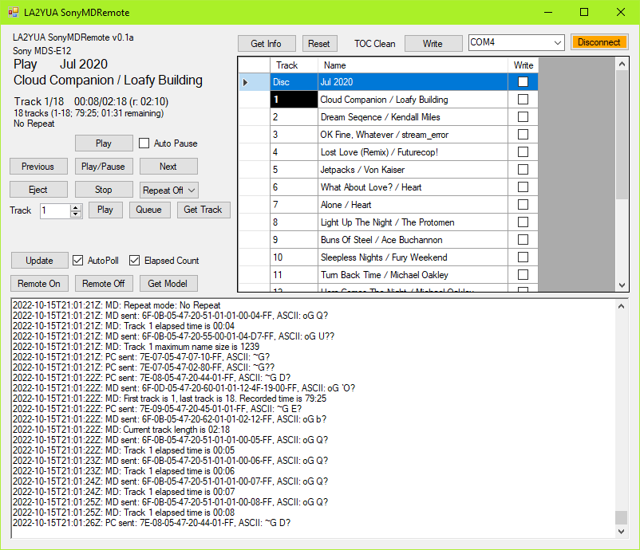

# SonyMDRemote
This is an attempt at making a C# application to talk to a Sony MDS-E12 MiniDisc recorder. If it works it should also work for the E11 and E52 models. 

The goal is to replace the older SonyMDRemote program, which doesn't really work at all on anything modern and is quite buggy even on older systems.

See the Docs folder for the protocol specifications if you want to help.
Currently targets .NET 4.7.2

## Hookup
You will need a female-female 9 pin D-Sub adapter cable (a null modem cable):
* Pin 2 to Pin 3
* Pin 3 to Pin 2
* Pin 5 to Pin 5

## Use
To connect, select a COM port from the selector, then click Get Info to start everything for playback/edit mode.

The textbox below logs the received data and debug info.

You can double click the leftmost part of a row to tell the MD to play a specific track. The currently playing track is bolded.

## Basic Command Sequence
Commands to the MD start with 0x7E, length, and some fixed parameters. Termination is 0xFF, and the length includes headers and termination.

Commands from the MD follow the same format, but start with 0x6F.

## Features implemented:
* Most MD-PC responses are decoded
* Reading disc name, track numbers etc. is supported
* Basic playback commands
* Write of both disc and track titles

## Planned:
* Polling state machine to read e.g. track number, status flags automatically (somewhat there)
* Check of maximum track name length - seems to be like 1700 chars per track though so not too important

## Not really working:
* Disc status and Power status appears to be incorrect for the E12

## Will likely not be supported:
* Recording
* Track splitting/editing

## Documentation & Player Bugs
Here's what I got so far, seems like there will be lots to come!
I've mostly been using the Combined E11, 12, 52 document.

### General Comms
The recorder doesn't clear its output buffers, so many outputs involving text contain trailing garbage after the null termination. This is slightly irritating in C# but manageable.

The protocol has no escape sequences, and the start and stop bytes are also valid payload data, _I don't like this. Don't do this._

As such, you do need stateful decoder that reads the packet length to determine when to stop and process data.

### 6.38 ALL NAME REQ
The returned 7.16 TRACK NAME messages appear to have the TrackNo field set to whatever track was last playing. This occurs even when the MD is ejected and reinserted.

## 7.11 STATUS DATA
Data2 bit 7 is listed as indicating if the TOC has been read. It does, but it also indicates "Not yet" state when the TOC is dirty after a write.

Track repeat modes are not documented in the base documentation, only an addendum which implies it's E12 exclusive.

### 7.16 TRACK NAME
The first packet is listed as:

	0x20, 0x4A, PacketNo, ASCII Data

The output appears to be :

	0x20, 0x4A, TrackNo, ASCII Data

The field descriptions and my observations suggest this is the case, at least when a specific track name is requested.

See also 6.38, this is not really reliable either.

### 7.22 TRACK TIME DATA
Sequence listed as:

	0x20 0x62 0x01 0x00 Min Sec

The actual fields are:

	0x20 0x62 0x01 TrackNo Min Sec

Further, requesting an invalid track number puts 0xFF in all fields from TrackNo and out.